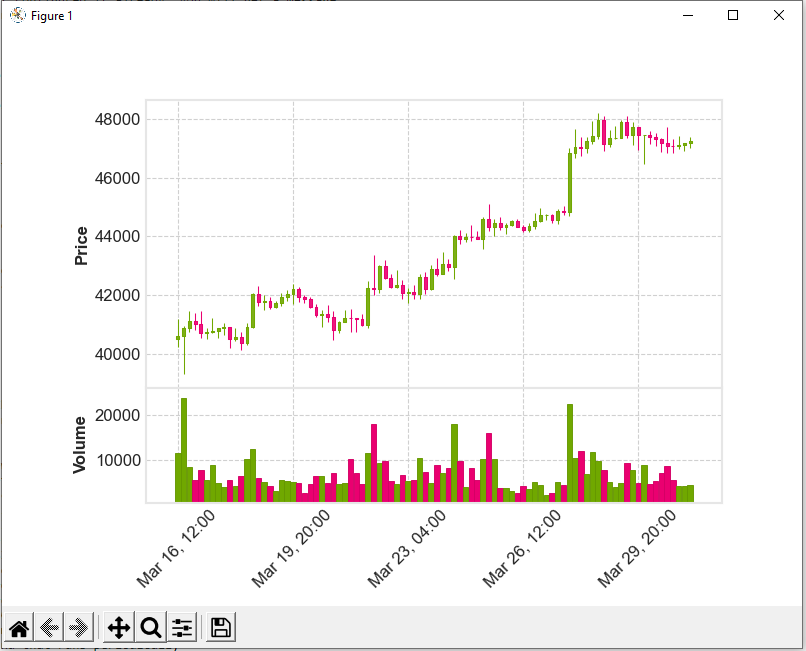
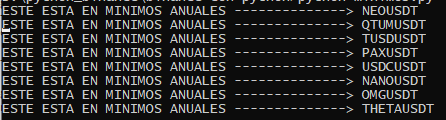

## This is a bot in construction

# Prerequisites of this tool
- Binance Account and API Key and Secret

# Running the tool

1- Install dependencies:

        `pip install python-binance python-dotenv --upgrade mplfinance datetime`

        or

        `pip install -r requeriments.txt`

2- Configuraction

        `cp .env_template .env`

        edit .env and add yours API Keys and Secret

3- Run the script:

        `python graficador.py`
        `python minimos.py`

# Screenshots

